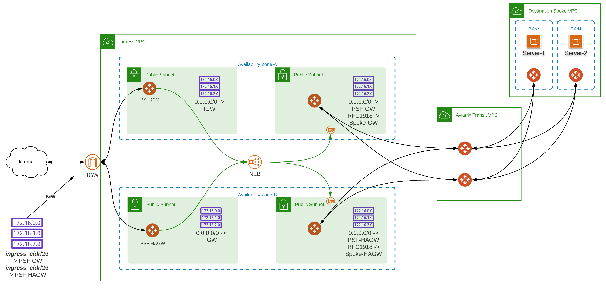
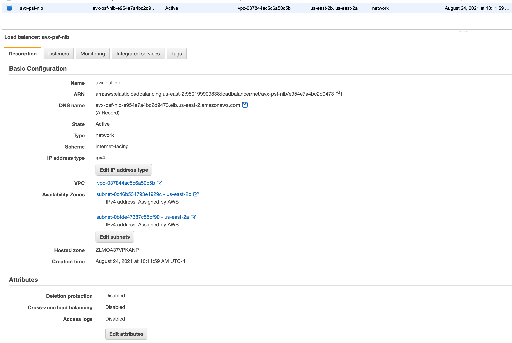
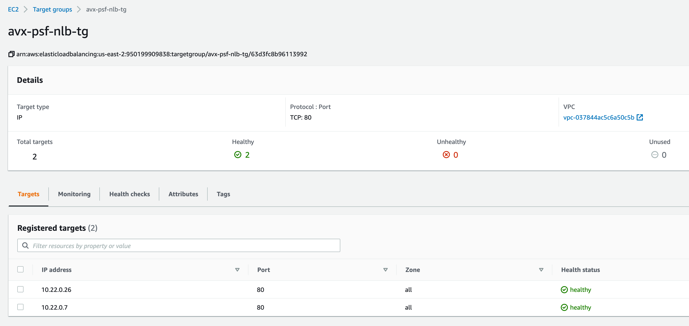
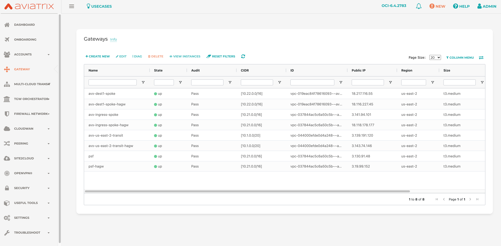

# Aviatrix Public Subnet Filtering with AWS Network Load Balancer integration

### Scenario

Customer needs to centralize and harden ingress security control in AWS using Aviatrix Transit Solution and [Public Subnet Filtering](https://docs.aviatrix.com/HowTos/public_subnet_filtering_faq.html?highlight=psf#what-does-public-subnet-filtering-gateway-do) gateways. 

This enables the customer to utilize an [AWS Network Load Balancer](https://docs.aws.amazon.com/elasticloadbalancing/latest/network/introduction.html) to define private IP targets and protocols in Aviatrix spoke VPCs in AWS under Aviatrix management.

Additionally, the customer can enable [AWS GuardDuty](https://aws.amazon.com/guardduty/) integration. Once GuardDuty is enabled, malicious source IP addresses attacking instances in the public subnets in the region will be polled by the Aviatrix Controller. The Aviatrix Controller then programs rules into the Public Subnet Filtering gateways to drop these packets.

The example in this repository demonstrates the functionality by deploying [NGINX Open Source packaged by Bitnami](https://aws.amazon.com/marketplace/pp/prodview-lzep7hqg45g7k) webservers with private IPs into the private subnets of the "destination" Aviatrix spoke. 

Once deployed, the customer can observe the default NGINX webservers by navigating to the public DNS url of the AWS Network Load Balancer, i.e. http://avx-psf-nlb-xxxxxxxxxx.elb.us-east-2.amazonaws.com/ 

This example can be modified to support any "destination" workloads to centralize and harden ingress security for AWS customers. 

### Architecture


### AWS Console (post-provisioning)

#### Load Balancer


#### Target Groups 
NGINX webservers in "destination" spoke with private IPs as targets of the NLB

  
### Aviatrix Controller (post-provisioning)


### Modules used

- https://registry.terraform.io/modules/terraform-aviatrix-modules/aws-transit/aviatrix/latest
- https://registry.terraform.io/modules/terraform-aviatrix-modules/aws-spoke/aviatrix/latest
- https://registry.terraform.io/modules/terraform-aws-modules/security-group/aws/latest
- Local bitnami nginx module created for test webservers running on port 80

### Compatibility
Terraform version | Controller version | Terraform provider version
:--- | :--- | :---
0.13,0.14,0.15 | 6.4.2783 | 2.19.5

### Variables

The variables are defined in ```terraform.tfvars```.

### Prerequisites

- Software version requirements met 
- Aviatrix Controller with Access Account in AWS
- terraform .13 or higher in the user environment ```terraform -v``` 
- AWS terraform provider requirements met 
- Active AWS marketplace subscription to [NGINX Open Source packaged by Bitnami](https://aws.amazon.com/marketplace/pp/prodview-lzep7hqg45g7k)

### Workflow

- Set TF_VARs for username, controller_ip, password in your env
- Modify ```terraform.tfvars``` _(i.e. access account name, regions, cidrs, etc.)_ and save the file.
- ```terraform init```
- ```terraform plan```
- ```terraform apply --auto-approve```
- ```cd ./02-aws-nlb``` and repeat

### Terraform state (post-provisioning) 

```
$ terraform state list
data.aws_route_table.spoke_pub_rt1
data.aws_route_table.spoke_pub_rt2
aviatrix_gateway.avx_psf_gateway_aws
module.spoke_aws_1.aviatrix_spoke_gateway.default
module.spoke_aws_1.aviatrix_spoke_transit_attachment.default[0]
module.spoke_aws_1.aviatrix_vpc.default[0]
module.spoke_aws_2.aviatrix_spoke_gateway.default
module.spoke_aws_2.aviatrix_spoke_transit_attachment.default[0]
module.spoke_aws_2.aviatrix_vpc.default[0]
module.transit_aws_1.aviatrix_transit_gateway.default
module.transit_aws_1.aviatrix_vpc.default
```

